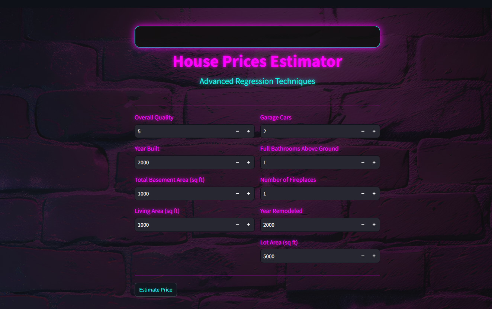

# House Prices Prediction App


This project implements a house price prediction application using a machine learning model trained on the [House Prices - Advanced Regression Techniques Dataset](https://www.kaggle.com/competitions/house-prices-advanced-regression-techniques/overview). It includes a web app which is built by streamlit and ipynb notebook for creating a model.

# Description


The House Prices Prediction App is a comprehensive tool designed to estimate the sale prices of houses based on various features using advanced machine learning techniques. The core of this application is built around a regression model trained on the House Prices dataset, ensuring high accuracy and performance.



# Installation and Setup
## Getting Started

To get started with Prices Prediction App, follow these steps:

## Clon the repository
* You can clone the Prices Prediction App repository from GitHub using the following command:
  
    ```bash
     git clone https://github.com/Slawoodman/Pricing-prediction.git
    ```
## Create a Virtual Environment
* It's recommended to create a virtual environment to manage  project dependencies. If you don't have virtualenv installed, you can install it using pip:
    ```bash
    pip install virtualenv
    ```
* Then, create a new virtual environment and activate it:

    ```bash
    virtualenv envname
    ```

    ```bash
    envname\scripts\activate
    ```

## Install Required Dependencies

* Navigate to the project directory:

    ```bash
    cd pricing-prediction
    ```
* Install the required dependencies listed in the requirements.txt file:
    ```
    pip install -r requirements.txt
    ```
   
## Run the Server

Now let's run the server:
  ```
  streamlit run app.py
  ```
  
